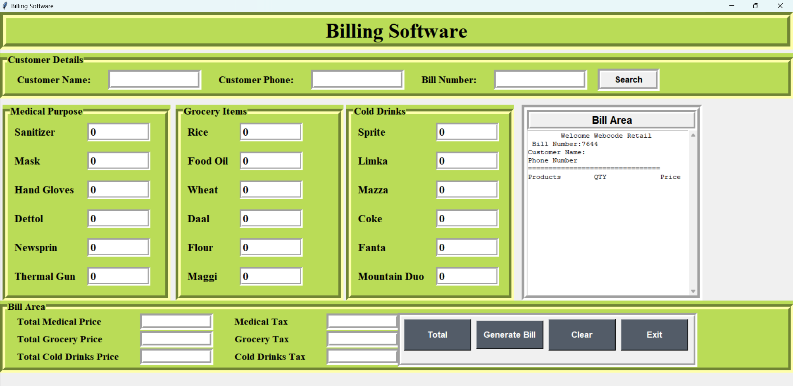

# Billing Software

## Description
This project is a GUI-based Billing Software developed using Python and the Tkinter library. It is a robust system that facilitates creating itemized bills for customers with features like product selection, tax calculation, and receipt saving.

## Features
- **Customer Management:** Add customer details (name, phone, and bill number) for recordkeeping.
- **Product Categories:** Includes Medical, Grocery, and Cold Drinks sections with various items.
- **Automated Billing:**
  - Calculate product prices with quantity.
  - Auto-apply taxes on each category.
- **Receipt Generation:** Generate and display an itemized bill in the software, and save it locally as a `.txt` file.
- **Search Past Bills:** Look up previously saved bills using the bill number.
- **User-Friendly GUI:** Intuitive layout with buttons for clearing data, calculating totals, generating bills, and exiting the application.


## Screenshots



## How to Run
1. Clone this repository:
   ```bash
   git clone https://github.com/yourusername/billing-software.git
   ```
2. Navigate to the project folder:
   ```bash
   cd billing-software
   ```
3. Run the Python file:
   ```bash
   python Bill.py
   ```


## Technologies Used
- **Python:** Core programming language.
- **Tkinter:** GUI framework for desktop application development.
- **OS Module:** File operations for saving and retrieving bills.
- **Random Module:** To generate unique bill numbers.

## Code Highlights
### GUI Design
Tkinter's `LabelFrame` and `Entry` widgets are extensively used for a clean and structured layout.

### Automated Bill Calculation
```python
self.total_medical_price = float(self.m_m_p + self.m_h_g_p + ...)
self.medical_price.set("Rs. " + str(self.total_medical_price))
self.c_tax = round((self.total_medical_price * 0.05), 2)
```

### Bill Generation
```python
self.txtarea.insert(END, f"\nProducts\t\tQTY\t\tPrice")
if self.sanitizer.get() != 0:
    self.txtarea.insert(END, f"\n Sanitizer\t\t{self.sanitizer.get()}\t\t{self.m_s_p}")
```

### Bill Saving and Retrieval
```python
self.bill_data = self.txtarea.get('1.0', END)
with open(f"bills/{self.bill_no.get()}.txt", "w") as f:
    f.write(self.bill_data)
```

## Contributions
Feel free to contribute! Fork the repository, create a new branch, and submit a pull request with improvements.

## License
This project is licensed under the [MIT License](LICENSE).
